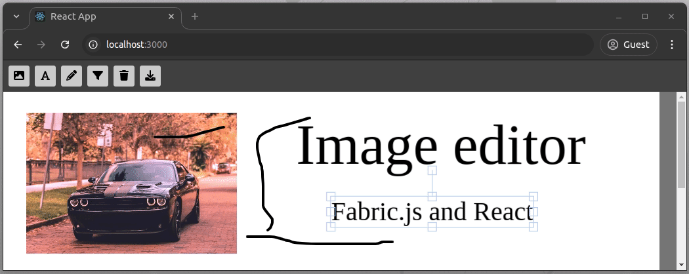

# fabric-image-editor
A simple image editor app created with Fabric.js v6 and React.



## How to run this project?
Clone the repository and install dependencies:

```bash
npm install
# --- or ---
yarn
```

Start the React development server:
```bash
npm start
#--- or ---
yarn start
```

## License
[MIT](LICENSE)
