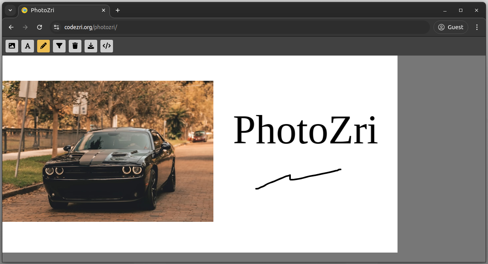

# PhotoZri
A simple image editor app created with Fabric.js v6 and React.



## How to run this project?
Clone the repository and install dependencies:

```bash
npm install
# --- or ---
yarn
```

Start the React development server:
```bash
npm start
#--- or ---
yarn start
```

## License
[MIT](LICENSE)


## Credits
The logo of the PhotoZri app is designed by 
[Andrean Prabowo](https://www.flaticon.com/authors/andrean-prabowo) and is download from
[Flaticons](https://www.flaticon.com/free-icon/gallery_6212173?term=photos&page=3&position=9&origin=search&related_id=6212173). 
Design credits go to the original icon author, Andrean Prabowo.
